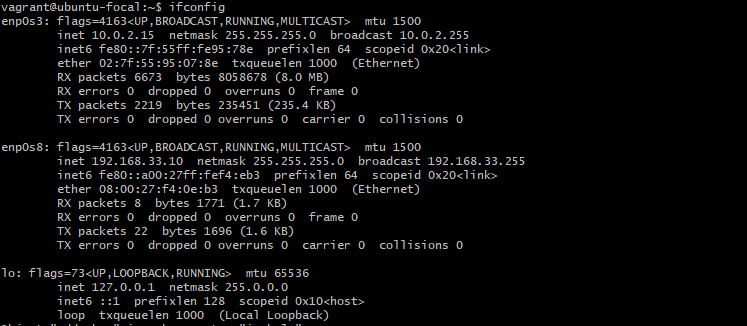

# How to Customize Vagrantfile with Private_Network set to dhcp

When it comes to managing virtual environments, Vagrant offers a seamless solution for automating the setup and configuration of development environments. One common customization is configuring a private network with DHCP, which allows your virtual machines to communicate with each other and the host system effortlessly. In this guide, we'll walk you through the process of customizing your Vagrantfile to enable DHCP for your private network.


### Locating and Editing the Vagrantfile
To begin, navigate to the directory containing your Vagrantfile using your terminal or command prompt. Once there, open the Vagrantfile in your preferred text editor. For instance, you can use nano by executing nano Vagrantfile.
```
nano Vagrantfile
``` 
### Integrating DHCP Configuration
Next, you'll need to integrate DHCP configuration into your Vagrantfile. Visit the Vagrant website and search for "private network" to find the necessary code snippet for DHCP setup. Copy this snippet and return to your Vagrantfile. Paste the DHCP configuration snippet into the Vagrantfile's configuration section, typically found at the bottom.
  

After pasting the DHCP configuration, save the configuration to **ctrl O** and exit nano with **ctrl X**

Now, you're ready to start Vagrant. Execute vagrant up and vagrant ssh in your terminal to initiate the virtual machine.

### Confirming DHCP Configuration

Inside the virtual machine, run the **ifconfig** command to confirm that the DHCP configuration has been successfully applied. You should see network interface information displayed, indicating that the private network is configured with DHCP You should get a result similar to the image below. 


In conclusion, customizing your Vagrantfile empowers you to tailor your virtual environment according to your specific requirements. By incorporating DHCP configuration for your private network, you ensure seamless communication between virtual machines and the host system. 