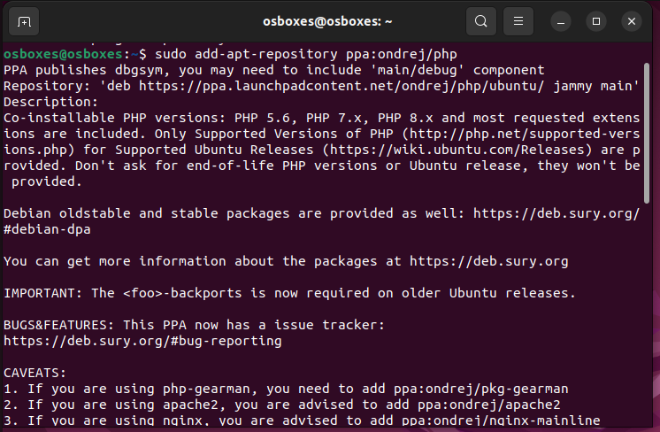
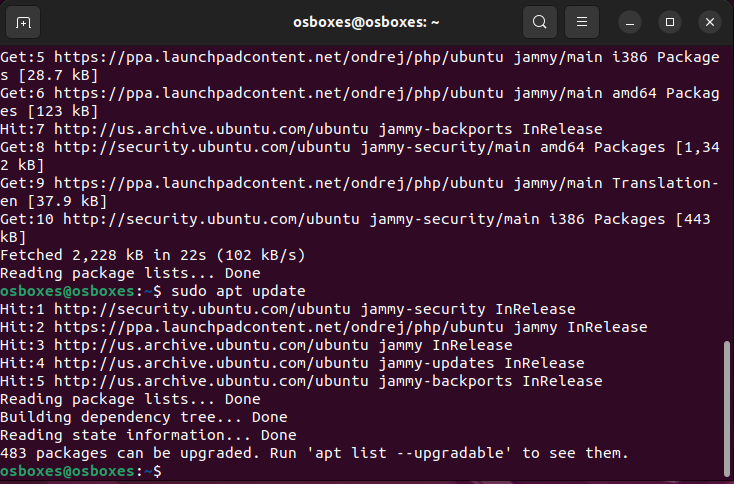
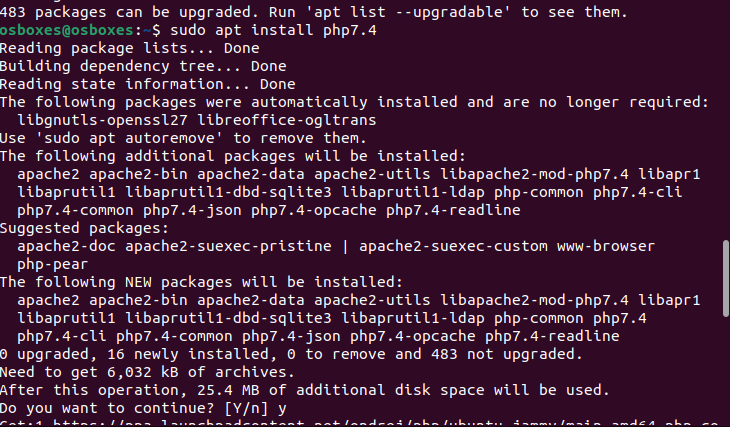
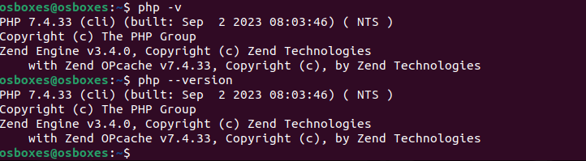
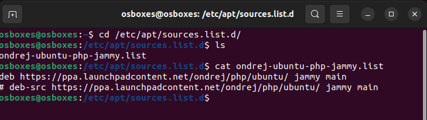

# Installing PHP 7.4 on Linux using ppa:ondrej/php

## Overview
This guide will show you the process of installing PHP 7.4 on your local Linux machine using the `ppa:ondrej/php` package repository.

## Prerequisites
- A Linux machine with sudo privileges.
- Basic knowledge of the command line.
## Tasks
Install PHP 7.4 on your local linux machine using the ppa:ondrej/php package repo.
### Instruction:
Learn how to use the add-apt-repository command
Submit the content of /etc/apt/sources.list and the output of php -v command.
### Step 1: Learn how to use `add-apt-repository`

The `add-apt-repository` command is a useful tool found in Debian-based systems like Ubuntu. It helps manage software repositories, which are storage locations holding software packages for your system. Its main function is to add new software repositories to your system's list, ensuring access to software not available in default repositories.

When you use `add-apt-repository`, it either modifies the files within `/etc/apt/sources.list` or adds new files within `/etc/apt/sources.list.d` directory. These files store information about the repositories your system uses. Additionally, the command can also remove repositories when needed. 

It's important to always use sudo when running add-apt-repository because this command modifies system files, requiring administrative privileges. When using the command, you typically follow two steps:  
Run the command with sudo and specify the repository URL or PPA (Personal Package Archive) like this:  
```
sudo add-apt-repository <repository> 
```
Replace < repository> with the actual address of the repository or PPA.  
After adding the repository, update your system's package list using the command:
```
sudo apt update
```  
This ensures that your system recognizes the new software available from the added repository.

### Step 2: Install PHP 7.4
Add the ppa:ondrej/php repository to your system:
```
sudo add-apt-repository ppa:ondrej/php
```

Update the package list
```
sudo apt update
```

Install PHP 7.4
```
sudo apt install php7.4
```
  
### Step 3: Verify the installation
To confirm and check the PHP version running, the command below is employed;
```
php -v
php --version
```


Furthermore, here is an example of what your `/etc/apt/sources.list.d` might look like after adding the `ppa:ondrej/php` repository:

That's it! You've successfully installed **PHP 7.4** on your Linux machine using the ``ppa:ondrej/php package repository.