# ALTSCHOOL CLOUD LIVE CLASS PROJECT
## This endeavor seeks to address the questions outlined within this project. 

### Question: 
### Your login name: altschool i.e., home directory /home/altschool. The home directory contains the following sub-directories: code, tests, personal, misc Unless otherwise specified, you are running commands from the home directory.

I began by creating a new user **"altschool"** and then proceeded to assign a password to the user. Also, **-m** is used while creating the new user, so the home directory can be created automatically. Even though it is possible to create the user without the home directory, when this is done. It could lead to potential issues when the user tries to log in. 
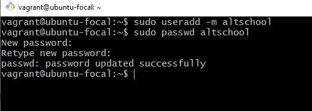  

After creating the user, i proceeded to switch into the new user created using the **su** command. Upon discovering my error in attempting to create multiple directories from the root, I entered the home directory of the new user using the  **cd /home/username** command. While in the home directory of the user created, to create the required sub-directories, I employed the **mkdir** command, creating multiple sub-directories at once. To confirm the directories have been created, i used the **ls** command.  
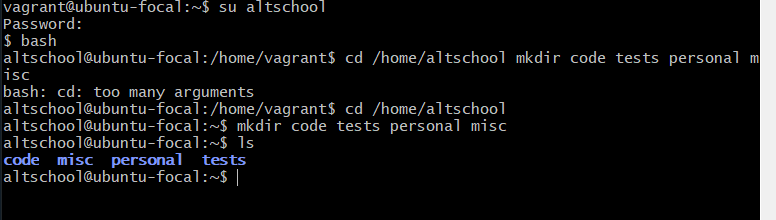  

### Question A: Change directory to the tests directory using absolute pathname  

To change directory from current directory to another directory using absolute pathname, the **cd** command is required, followed by the path to the location of the file/ directory. The **cd** command used to change the current working directory, while **/path/to/directory** outlines the absolute path to the target directory. It is important to note that Linux is case-sensitive, so make sure to enter the path with the correct capitalization

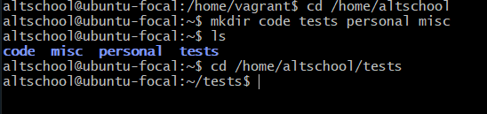  

### Question B: Change directory to the tests directory using relative pathname  

Unlike the absolute pathname, the relative pathname is a much more easier way of changing directories on Linux. Instead of providing the complete path from the root directory as it is done with the absolute pathname. Here, you only have to specify the location of the target directory or file relative to your current position in the directory tree. It is important to note that **cd ..** is used to go back my one directory or back to the parent directory as the case maybe. 

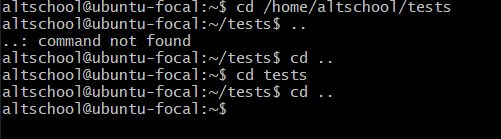  

### Question C: Use echo command to create a file named fileA with text content ‘Hello A’ in the misc directory  

The **echo** command is usually used to display text or to redirect a text into a file. If you want to use **echo** to create a new file with specific content, you can combine it with the output redirection operator **(>)**.  
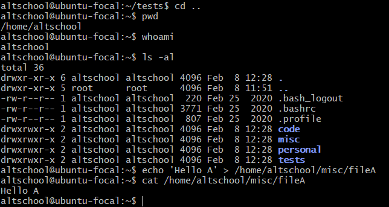
Furthermore, because all file and commands are supposed to start from the home directory, the commands **pwd and whoami** were used to confirm my current location. Thereafter, the **echo** command alongside the text in single quotes **' '**  with  **>** to the absolute pathname of the file to be created.   
It is important to note that the append operator **(>>)** can be used to append a text to an existing file.  

### Question D: Create an empty file named fileB in the misc directory  
The **touch** command is used to create empty files on the Linux operating system. To create the empty file, the command is run from the home directory alongside the collect absolute pathname as shown in the image below. 
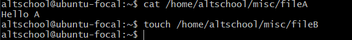  

### Question E: Copy contents of fileA into fileC  
To copy the contents of "fileA" into a new file named "fileC," the **cp** command is employed.  After copying the contennt of "fileA" to "fileC", you use the **cat** command to confirm the action carried out was successful. 

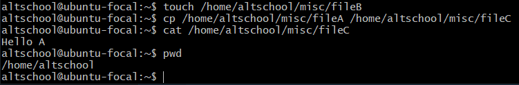  

### Question F: 
### F(i): Move contents of fileB into fileD  
The **mv** command on Linux is used to move or rename files and directories. I began by inputing the source file which is **/home/altschool/misc/fileB**, followed by the destination path of the file which is **/home/altschool/misc/fileD**. Since the file doesn't exist, the **mv** command will rename the source to the specified destination. 

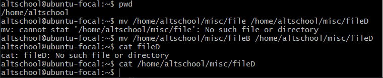

### F(ii): Create a tar archive called misc.tar for the contents of misc directory  
The **tar** command is used creating and manipulating archive files. Under the **tar** command, various parameters and options are used to modify the achieve file. These options include; **-c** which is used to create a new archive, **-x** which is used to extract files from an archive, **-v** which known as the **verbose mode** and used to give more information about the achieve files and **-f** which specifies the name of the archive file. When employing, this comman, they can be used together. Therefore to attempt the question, I used the **tar -cvf misc.tar /pathname** command to convert the content of the misc directory to an archive file. 

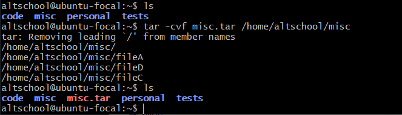   

### F(iii): Compress the tar archive to create a misc.tar.gz file  
The **gzip** command is used to compress a file into a zip file and to reverse or decompress a zip file, the **gunzip** command is used. Therefore, to compress the tar archive file, i just used the **gzip** command followed by the file name.  

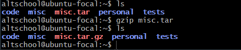  

### G.	Create a user and force the user to change his/her password upon login  
To attempt this question, according to the instrcution of creating and answering all questions from the home directory of the user "altschool". the user "altschool" had to be added to the sudo group and this was done using **sudo usermod -aG sudo altschool** command. This was done on the vagrant user and after it, we logged in back into the "altschool" user to attempt the question above.  
Using the command **sudo useradd -m Bruno**, a new user "Bruno" is created, and a password is configured for this user as well. Then the command **sudo passwd --expire Bruno** is used to force the user to change the current password upon log in as seen in the image below.  
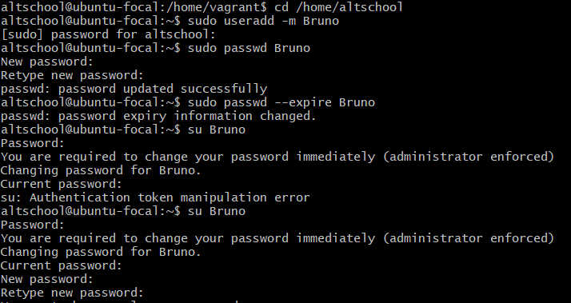  

### H. Lock a users password
To lock a user, the command **sudo passwd -l username** will be used. This command locks the specified user's password and makes it impossible for them to log in when the password because the system will deny them access, whenever they try to log in. If you later wish to unlock the user's password, you can use the **-u** command to do so. 

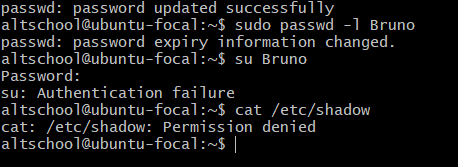  

### I. Create a user with no login shell  
There are various ways to create a user with no login shell. The command **sudo useradd -s /bin/false username** and **sudo useradd -s /sbin/nologin username** can be used to achieve this. The **-s** is used to specify a null shell.  

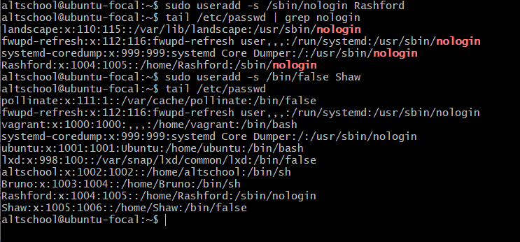  

### J. Disable password based authentication for ssh  

To disable password-based authentication for SSH and only allow authentication using SSH keys, you need to modify the SSH daemon configuration file which is located at /etc/ssh/sshd_config. I opened the SSH configuration file using nano text editor through the command **sudo nano /etc/ssh/sshd_config**  
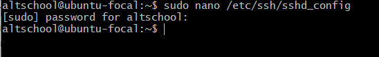  
Thereafter, i scrolled to the password authentication to ensure it set to No.  
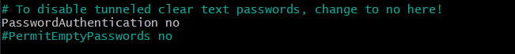  

### K. Disable root login  
Once again, we log into the SSH daemon configuration file which is located at /etc/ssh/sshd_config using the command **sudo nano /etc/ssh/sshd_config**.  
  
Within the text edditor, i searched for the root login permit and modify it.   
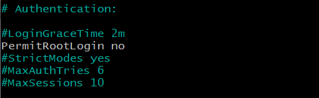  
After this, ssh restart is ran. 
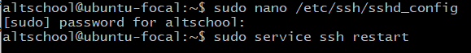  

We have come to the end of my attempt of this project. 

